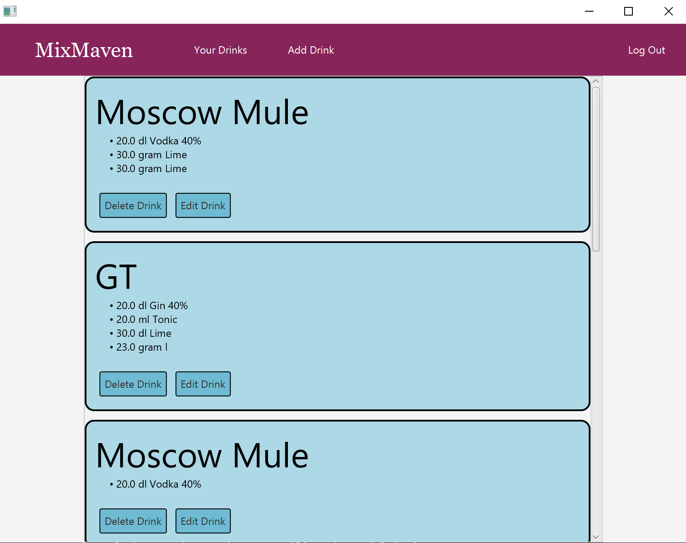
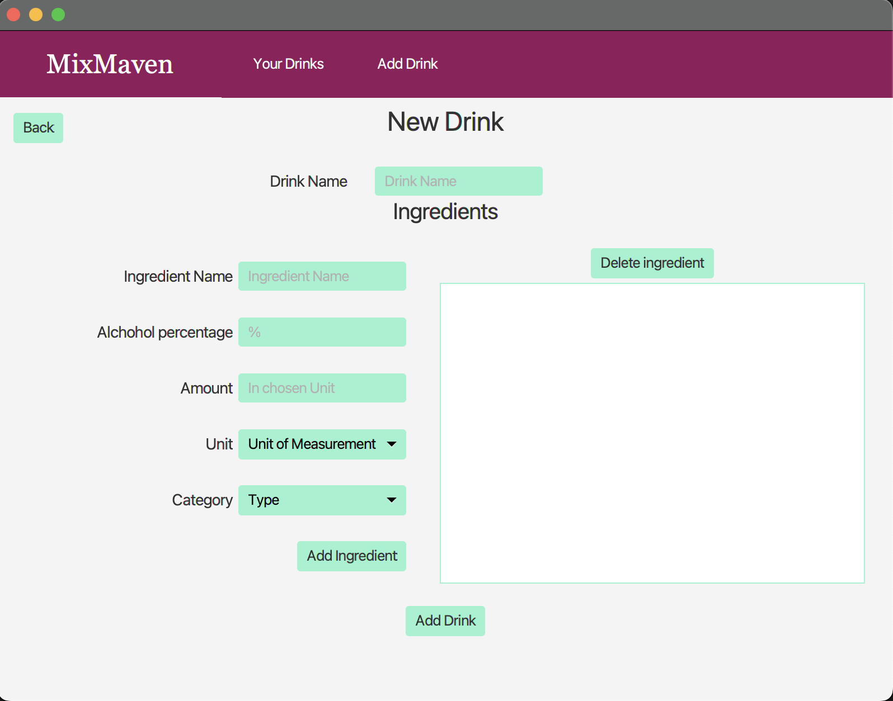

# MixMaven

IT1901 Project - MixMaven is an app for managing drink recipes.

Here you can gather all your drink recipes in one easy to use application. Simply add/edit/delete any recipe you could imagine!

You will find all documentation in the [docs folder](/docs/).

## Eclipse Che

The app has been configurated to work with [eclipse che](https://che.stud.ntnu.no/#https://gitlab.stud.idi.ntnu.no/it1901/groups-2023/gr2331/gr2331?new)

## Code base

1. The project inside the [mixmaven](./mixmaven/) folder contains the following modules:

    - Core - Core logic for the app
    - Json - Serialization/desirialization and filehandling
    - Springboot - The server
    - UI - The JavaFX client

    The JavaFX client is designed to utilize the springboot server for datahandling, however it can also run without the server and utilize core/json directly.

    This project is configured to run with maven. For further information and a guide to run this project see this [README](./mixmaven/README.md).

2. The project inside the [webapp](./webapp/) folder is a modern alternative to the JavaFX client created with REACT, however it is dependent on the server inside the mixmaven project.

    For further information on the webapp and how to run it yourself see this [README](./webapp/README.md).

### JavaFX client (mixmaven.ui)

Home page                                                  |  New/edit drink page
:---------------------------------------------------------:|:---------------------------------------------:
  |  

### React Client (webapp)

Home page                                    |  New/edit drink page
:-------------------------------------------:|:---------------------------------------------:
  |  
