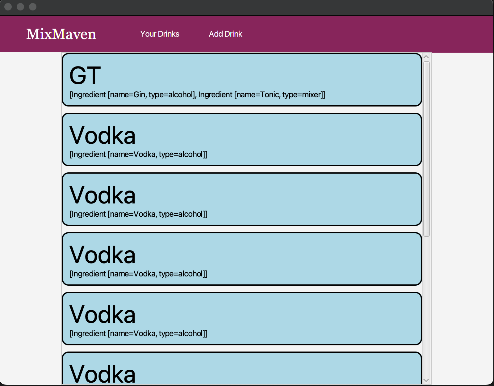
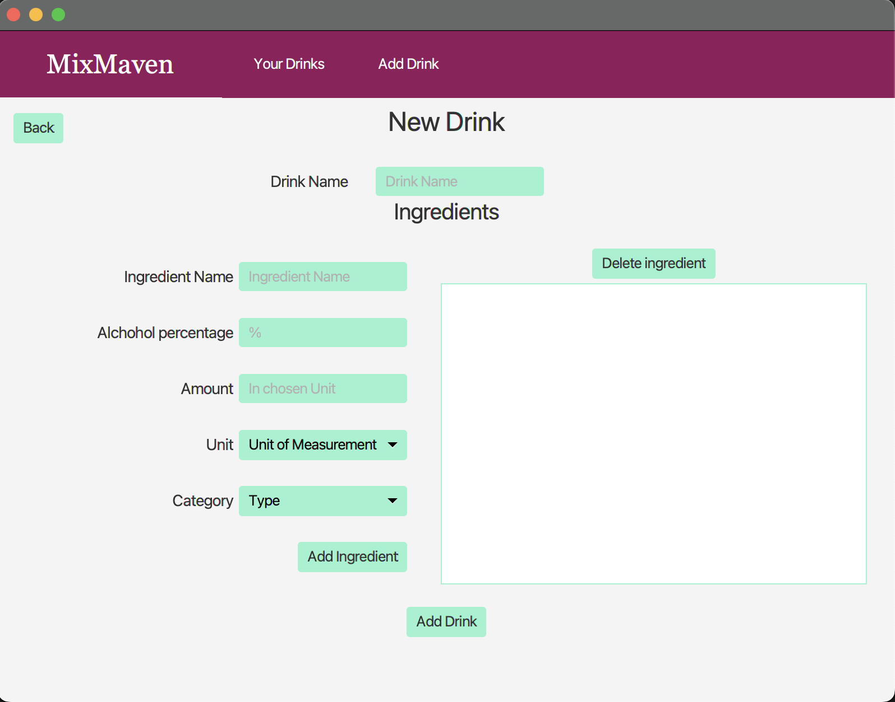

# RELEASE 1

Date: Thursday 21. september 2023 \
Assignment: 1

**Ambitions**

For release 1 our goal was a simple app allowing the user to create, read, update and delete drinks through a simple UI. It would consist of two pages, one for browsing drinks and deleting drinks and one for adding new Drinks with any kind of ingredients. The application saves data to json in order to create persistence ensuring that the user can access drinks from previous sessions. We wanted to add good automatic testing with testing coverage early in order to make future development easier.

In this regard our applications lacks the features for deleting drinks and updating drinks and their ingredients which is something we want to add in future releases. We have currently set up JaCoCo for test coverage and one test which is less than we wanted. Moving forward we will prioritize increasing number of tests and test coverage. 

**Work process**

We have strived to model our development process after agile development practices like scrum. Our plan was to work in weekly sprints allowing us to consistently reach goals and review each others work. Thus far our work has been somewhat less structured due to time constraints but is a priority moving forward.

Using Gitlabs issueboard feature we have created a backlog of issues which are then assigned to a developer ensuring that everyone has an idea of what is being done and who is doing it. 
Additionally we use have utilized pair programming assigning on a pair on the [ui](/src/main/java/ui) module and one pair on the [core](../core/) module.

## Current Design

